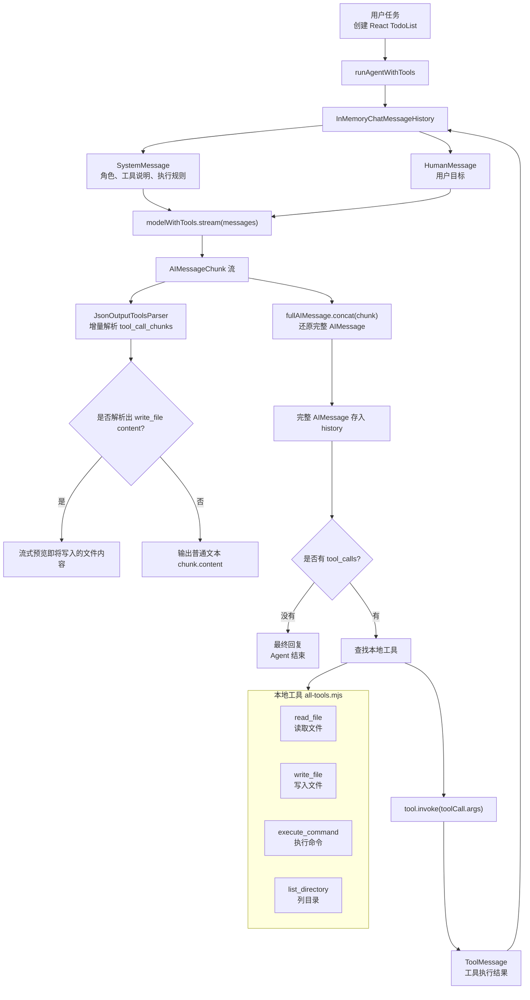
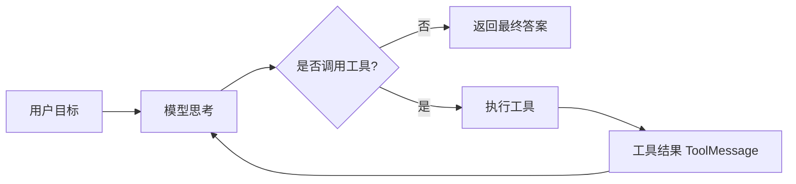
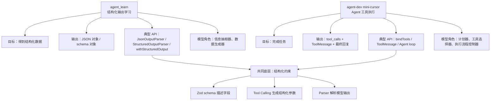
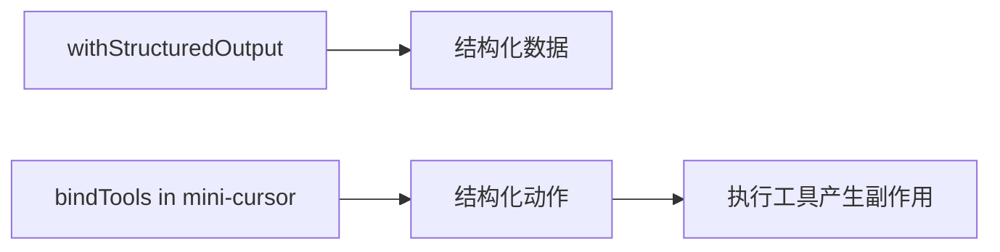
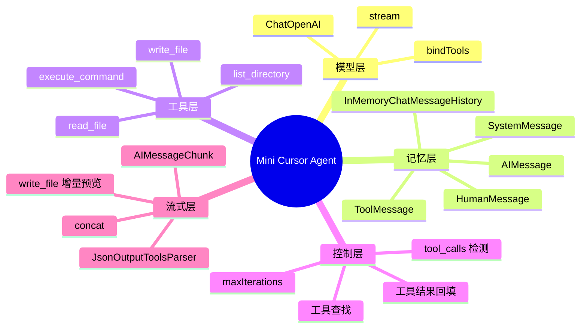
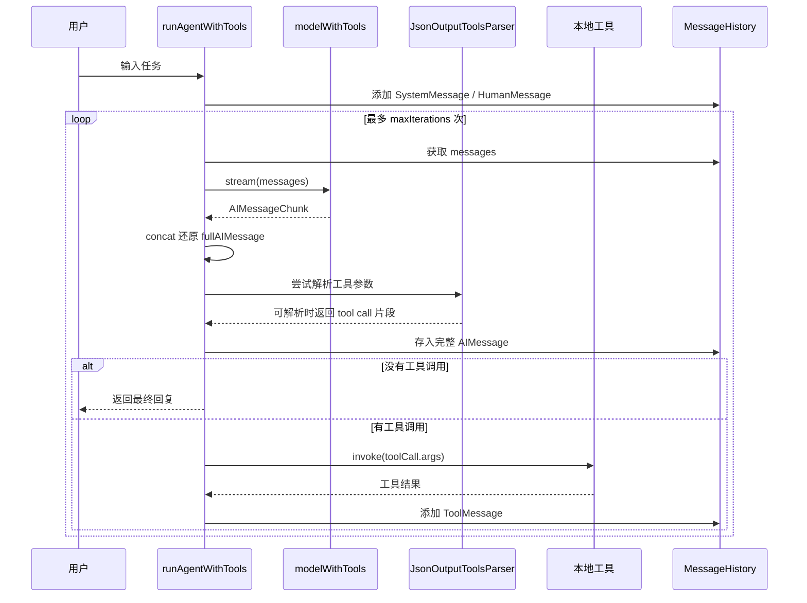

# Mini Cursor Agent 知识图谱

对应核心文件：`src/tools/mini-cursor.mjs`

这个文件不是单纯演示“结构化输出”，而是在实现一个最小版 Cursor：模型先思考下一步要做什么，然后通过工具读取文件、写文件、执行命令、查看目录，再把工具结果放回上下文，继续下一轮，直到模型不再发起工具调用。

## 总览图



## 代码主线

### 1. 模型和工具绑定

`mini-cursor.mjs` 先初始化 `ChatOpenAI`，然后把四个工具绑定给模型：

```js
const tools = [
  readFileTool,
  writeFileTool,
  executeCommandTool,
  listDirectoryTool,
];

const modelWithTools = model.bindTools(tools);
```

这里的重点是：模型不是直接操作文件系统，而是生成结构化的 `tool_calls`，由你的 JS 代码去执行真实工具。

工具定义在 `src/tools/all-tools.mjs`：

| 工具 | schema 参数 | 作用 |
| --- | --- | --- |
| `read_file` | `filePath` | 读取指定文件内容 |
| `write_file` | `filePath`, `content` | 写入文件，并自动创建目录 |
| `execute_command` | `command`, `workingDirectory?` | 执行 shell 命令 |
| `list_directory` | `directoryPath` | 查看目录下文件 |

这些 schema 和你在 `agent_learn` 里学到的 Zod schema 是同一种思想：用结构化定义约束模型输出。区别是这里的结构不是最终答案，而是“下一步动作的参数”。

### 2. Agent 循环

核心函数是：

```js
async function runAgentWithTools(query, maxIterations = 30)
```

它做了一个典型 Agent loop：



每一轮循环都包含：

- 从 `history` 取出当前消息。
- 调用 `modelWithTools.stream(messages)`。
- 拼接完整的 `AIMessage`。
- 如果有 `tool_calls`，执行工具。
- 把工具执行结果作为 `ToolMessage` 加回历史。
- 下一轮让模型基于新上下文继续决策。

这就是 Agent 和普通 LLM 调用的根本区别：普通 LLM 一次回答，Agent 会多轮“计划 -> 行动 -> 观察 -> 再计划”。

### 3. 流式处理

这个文件比 `src/mini-cursor.mjs` 更复杂，因为它使用了流式输出。

关键代码思路：

```js
const rawStream = await modelWithTools.stream(messages);
let fullAIMessage = null;
const toolParser = new JsonOutputToolsParser();

for await (const chunk of rawStream) {
  fullAIMessage = fullAIMessage ? fullAIMessage.concat(chunk) : chunk;
  parsedTools = await toolParser.parseResult([{ message: fullAIMessage }]);
}
```

这里同时做了两件事：

- `fullAIMessage.concat(chunk)`：把流式碎片还原成最终完整的 AIMessage，这个最终消息必须放进 history，否则后续工具调用上下文会丢。
- `JsonOutputToolsParser`：尝试在 JSON 工具参数还没完全生成时，提前解析已经能读出来的部分。

它专门对 `write_file` 做了流式预览：

```js
if (toolCall.type === "write_file" && toolCall.args?.content) {
  const newContent = currentContent.slice(previousLength);
  process.stdout.write(newContent);
}
```

这相当于模拟 Cursor 写文件时的体验：模型还在生成 `write_file.content`，终端里已经能看到它准备写入的代码。

## 和 agent_learn 结构化输出的区别



主要区别：

| 维度 | `agent_learn` 那些示例 | `mini-cursor.mjs` |
| --- | --- | --- |
| 学习目标 | 让模型返回稳定结构化数据 | 让模型调用工具完成任务 |
| 模型输出的含义 | 最终数据 | 下一步动作 |
| 是否有副作用 | 通常没有，只是解析结果 | 有，能写文件、跑命令、创建项目 |
| 核心循环 | 多数是一次调用 | 多轮 Agent loop |
| 工具调用用途 | 常用于拿结构化结果 | 用于真实执行外部动作 |
| 结果位置 | `result` / parsed object | `response.tool_calls[*].args`、工具返回的 `ToolMessage`、最终回复 |
| 典型风险 | JSON 不合法、schema 不匹配 | 工具误用、命令执行失败、写错文件、循环失控 |

## 和 agent_learn 的联系

### 1. `tool-call-args.mjs` 是 mini-cursor 的前置知识

在 `agent_learn/src/tool-call-args.mjs` 中，你已经看到：

```js
const response = await modelWithTool.invoke("介绍一下爱因斯坦");
const result = response.tool_calls[0].args;
```

那里的工具调用只是为了拿到结构化参数。

在 `mini-cursor.mjs` 中，思路变成：

```js
for (const toolCall of fullAIMessage.tool_calls) {
  const foundTool = tools.find((t) => t.name === toolCall.name);
  const toolResult = await foundTool.invoke(toolCall.args);
}
```

也就是：不只是读取 `args`，还真的执行这个工具。

### 2. `withStructuredOutput` 是“伪工具调用”，mini-cursor 是“真工具调用”

`withStructuredOutput(schema)` 的目标是让模型返回符合 schema 的数据。即使底层可能使用 tool calling，你通常不会真的执行某个业务工具。

`mini-cursor.mjs` 的 tool call 是行动指令：

- `read_file` 会真的读取文件。
- `write_file` 会真的写入文件。
- `execute_command` 会真的跑命令。
- `list_directory` 会真的查看目录。

所以可以这样理解：



### 3. `stream-tool-calls-parser.mjs` 是这个文件流式预览的前置知识

`agent_learn/src/stream/stream-tool-calls-parser.mjs` 学的是：

- 模型可以流式产生工具调用参数。
- `JsonOutputToolsParser` 可以解析工具调用流。

`src/tools/mini-cursor.mjs` 把它用到一个真实 Agent 中：

- 解析 `write_file` 的 `content`。
- 记录已打印长度。
- 只打印新增部分。
- 最后仍然等待完整 `AIMessage`，再真正执行工具。

这个设计很重要：流式预览不是工具执行本身。真正写文件发生在完整 `tool_calls` 解析完以后。

## 这个文件体现的 Agent 基础能力



## 关键执行链路



## 当前实现的工程注意点

这份代码适合学习 Agent 原理，但如果要接近生产环境，需要补强：

- `execute_command` 使用 `shell: true`，而且允许模型决定命令，真实项目中必须加权限控制、命令白名单或用户确认。
- `write_file` 可以写任意路径，最好限制工作目录，避免误写系统文件或其他项目。
- 工具执行是串行的，没有区分可并行工具和必须串行工具。
- `maxIterations = 30` 能防止无限循环，但没有更细的停止条件和错误恢复策略。
- `JsonOutputToolsParser` 增量解析失败时直接忽略是合理的学习写法，但生产中需要更明确的调试日志。
- `execute_command` 里同时 `command.split(" ")` 和 `shell: true`，对复杂命令、引号、管道的语义容易混乱；既然用了 shell，更适合让 shell 处理完整 command。

## 一句话总结

`agent_learn` 里的零散文件是在学习“怎么让 LLM 输出结构化数据”；`src/tools/mini-cursor.mjs` 是把这些结构化能力升级成 Agent 行动系统：模型输出的不再只是答案，而是可被程序执行的结构化工具调用。
