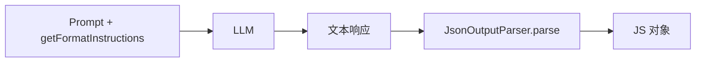
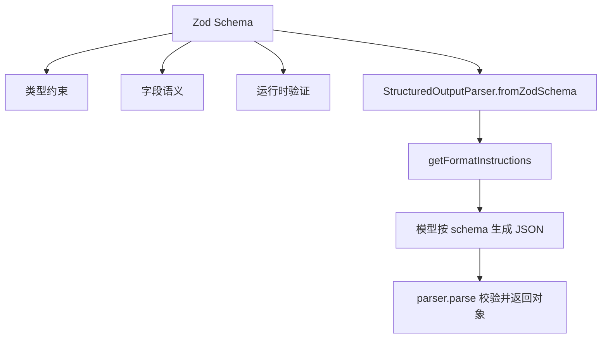
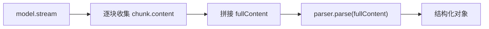
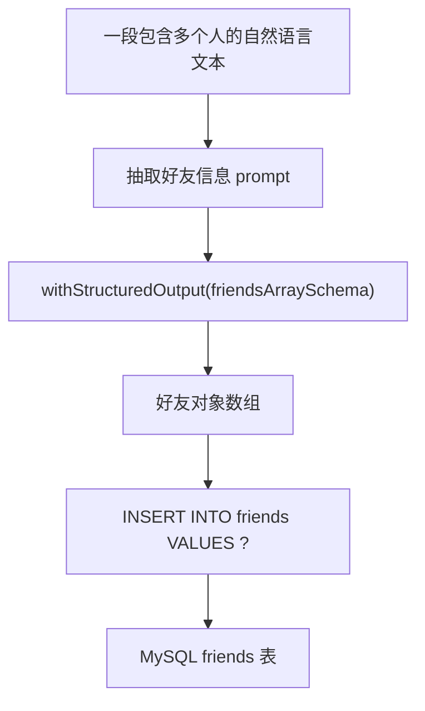
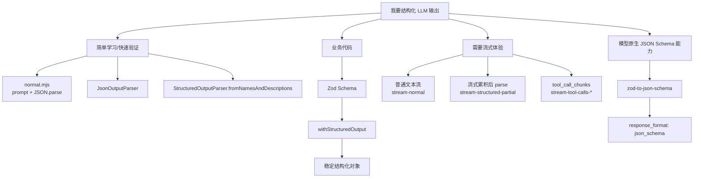

# Agent 结构化输出知识图谱

这份图谱围绕 `agent_learn/src` 下的 `.mjs` 文件整理。它的主线是：让 LLM 从“自由文本回答”逐步变成“可验证、可解析、可流式处理、可落库”的结构化数据生产者。

## 总览图

```mermaid
flowchart TD
  A["LLM 输出控制"] --> B["普通提示词约束"]
  A --> C["Output Parser"]
  A --> D["Zod Schema"]
  A --> E["Tool Calling"]
  A --> F["withStructuredOutput"]
  A --> G["Stream 流式输出"]
  A --> H["业务落库"]

  B --> B1["normal.mjs<br/>要求模型返回 JSON"]
  B1 --> B2["JSON.parse<br/>脆弱：依赖模型严格遵守格式"]

  C --> C1["json-output-parser.mjs<br/>JsonOutputParser"]
  C --> C2["structured-output-parser.mjs<br/>StructuredOutputParser.fromNamesAndDescriptions"]
  C --> C3["xml-output-parser.mjs<br/>XMLOutputParser"]
  C1 --> C4["parser.getFormatInstructions<br/>把格式要求注入 prompt"]
  C2 --> C4
  C3 --> C4
  C4 --> C5["parser.parse<br/>把模型文本解析成对象"]

  D --> D1["structured-output-parser2.mjs<br/>StructuredOutputParser.fromZodSchema"]
  D --> D2["字段类型<br/>string / number / array / object / optional"]
  D --> D3["字段语义<br/>describe 指导模型生成"]
  D --> D4["运行时验证<br/>不符合 schema 会报错"]

  E --> E1["tool-call-args.mjs<br/>bindTools"]
  E1 --> E2["模型生成 tool_calls"]
  E2 --> E3["response.tool_calls[0].args<br/>直接拿结构化参数"]

  F --> F1["with-structured-output.mjs"]
  F1 --> F2["优先使用 Tool Calling"]
  F1 --> F3["不支持工具时退回 parser"]
  F2 --> F4["推荐的一般结构化输出入口"]

  G --> G1["stream-normal.mjs<br/>普通文本流"]
  G --> G2["stream-structured-partial.mjs<br/>流式文本累积后 parse"]
  G --> G3["stream-with-structured-output.mjs<br/>结构化结果通常最后一次性返回"]
  G --> G4["stream-tool-calls-raw.mjs<br/>读取 tool_call_chunks 原始参数片段"]
  G --> G5["stream-tool-calls-parser.mjs<br/>JsonOutputToolsParser 解析工具流"]

  H --> H1["mysql/create-table.mjs<br/>建库建表与插入 demo"]
  H --> H2["mysql/smart-import.mjs<br/>文本抽取好友数组并批量入库"]
  H --> H3["mysql/structured-json-schema.mjs<br/>原生 JSON Schema response_format"]
  H2 --> H4["LLM 提取 → Schema 验证 → SQL 批量插入"]
```



## 学习路径

### 1. 自然语言约束：能用，但不稳

对应文件：`src/normal.mjs`

这个示例直接在 prompt 中要求模型“以 JSON 格式返回”，然后用 `JSON.parse(response.content)` 解析。

核心知识点：

- LLM 默认输出是自然语言，不天然等于稳定 JSON。
- 只靠 prompt 约束时，模型可能返回 Markdown 代码块、额外解释、字段缺失或类型错误。
- `JSON.parse` 只能解析合法 JSON，不能处理“看起来像 JSON 但夹杂说明文字”的输出。

适用场景：

- 快速实验。
- 对格式可靠性要求不高。
- 本地学习 parser 之前的对照组。

### 2. JsonOutputParser：把格式要求交给 parser

对应文件：`src/json-output-parser.mjs`

`JsonOutputParser` 提供两个关键动作：

- `parser.getFormatInstructions()`：生成格式说明，拼进 prompt。
- `parser.parse(response.content)`：把模型返回文本解析成 JSON 对象。

它比手写 `JSON.parse` 更适合作为 LangChain 链路的一部分，但它仍然主要解决“解析 JSON”问题，不负责强类型 schema 验证。

知识位置：



### 3. StructuredOutputParser：给字段命名和解释

对应文件：`src/structured-output-parser.mjs`

这个示例使用：

```js
StructuredOutputParser.fromNamesAndDescriptions({
  name: "姓名",
  birth_year: "出生年份",
  nationality: "国籍",
  major_achievements: "主要成就，用逗号分隔的字符串",
  famous_theory: "著名理论",
});
```

核心价值：

- 明确有哪些字段。
- 给每个字段加语义说明。
- 自动生成格式指令。
- 返回对象时更接近固定结构。

局限：

- 字段类型约束较弱。
- 复杂嵌套对象、数组对象、可选字段表达能力有限。
- 更适合简单结构化输出。

### 4. Zod Schema：结构化输出的类型系统

对应文件：`src/structured-output-parser2.mjs`

这个文件是前面 parser 示例的升级版，用 Zod 表达复杂结构：

- 基础字段：`z.string()`、`z.number()`
- 数组字段：`z.array(z.string())`
- 对象数组：`z.array(z.object({...}))`
- 可选字段：`.optional()`
- 字段说明：`.describe(...)`

关键点：

- Zod 不只是告诉模型“怎么写”，也是程序端的运行时验证规则。
- `.describe()` 会进入格式说明，帮助模型理解字段语义。
- schema 越清晰，结构化输出越稳定。
- 复杂业务数据建议优先从 Zod schema 开始设计。

知识关系：



### 5. Tool Calling：结构化输出的底层更优路径

对应文件：`src/tool-call-args.mjs`

这个示例用 `model.bindTools(...)` 绑定一个工具：

```js
const modelWithTool = model.bindTools([
  {
    name: "extract_scientist_info",
    description: "提取和结构化科学家的详细信息",
    schema: scientistSchema,
  },
]);
```

模型返回时，结构化数据在：

```js
response.tool_calls[0].args
```

关键理解：

- Tool Calling 本质上让模型生成“函数参数”。
- 函数参数必须符合 schema，约束比纯文本 JSON 更强。
- 如果只是为了拿结构化数据，也可以把“工具参数”当成结构化输出。
- 这是 `withStructuredOutput` 的重要底层实现方式。

### 6. withStructuredOutput：日常最推荐入口

对应文件：`src/with-structured-output.mjs`

这个 API 封装了结构化输出的策略选择：

```js
const structuredModel = model.withStructuredOutput(scientistSchema);
const result = await structuredModel.invoke("介绍一下爱因斯坦");
```

重要理解：

- 如果模型支持 Tool Calling，它优先用工具调用方式获取结构化结果。
- 如果模型不支持工具调用，它可以退回 parser 方式。
- 使用者只需要关注 schema 和最终 result。
- 在多数业务代码里，它比手动 parser 更简洁、更稳。

实践建议：

- 学习阶段：先理解 parser 和 tool call。
- 写业务代码：优先用 `withStructuredOutput(schema)`。
- 需要调试底层行为：再查看 `response.tool_calls` 或 parser 的原始输出。

## 流式输出分支

流式输出的核心问题是：结构化数据需要完整 JSON 才能验证，但用户体验又希望边生成边展示。

### 1. 普通文本流

对应文件：`src/stream/stream-normal.mjs`

使用：

```js
const stream = await model.stream(prompt);
for await (const chunk of stream) {
  process.stdout.write(chunk.content);
}
```

特点：

- 最接近普通 ChatGPT 的逐字输出体验。
- 适合文章、解释、摘要、长文本。
- 不保证结构化字段完整。

### 2. 流式生成 JSON，最后统一 parse

对应文件：`src/stream/stream-structured-partial.mjs`

思路：



特点：

- 控制台可以看到模型逐步生成 JSON。
- 真正可用的结构化对象要等完整内容生成后再解析。
- 如果中途 JSON 不完整，不能直接当最终对象使用。

### 3. withStructuredOutput 的流式限制

对应文件：`src/stream/stream-with-structured-output.mjs`

文件注释已经点明核心现象：虽然调用了 `.stream()`，但 `withStructuredOutput` 通常会等 JSON 生成完并通过校验后，再返回完整结构。

因此它更像“异步等待一个结构化结果”，而不是“字段逐步流式可用”。

适合：

- 你只关心最终结构化结果。
- 不需要边生成边展示字段。
- 希望结构可靠性优先。

不适合：

- 需要实时展示每个字段逐步生成过程。
- 需要边生成边更新 UI。

### 4. Tool Calls 原始流

对应文件：`src/stream/stream-tool-calls-raw.mjs`

这个示例直接读取：

```js
chunk.tool_call_chunks[0].args
```

它展示了 Tool Calling 在流式模式下，工具参数也可以分片返回。

核心理解：

- tool call 的参数不是一次性完整出现，也可能按 chunk 分片生成。
- 原始分片适合观察底层协议和调试。
- 直接拼接原始 `args` 时要注意空值、顺序和 JSON 完整性。

### 5. Tool Calls Parser 流

对应文件：`src/stream/stream-tool-calls-parser.mjs`

这个示例使用：

```js
const parser = new JsonOutputToolsParser();
const chain = modelWithTool.pipe(parser);
const stream = await chain.stream("详细介绍牛顿的生平和成就");
```

它把工具调用流接到 parser 上，尝试把 tool call chunks 转成可读的结构化片段。

适合进一步研究：

- 如何在 UI 中逐步展示结构化字段。
- 如何处理 tool call 参数的增量解析。
- 如何把“流式体验”和“结构化数据”同时保留。

## XML 分支

对应文件：`src/xml/xml-output-parser.mjs`

`XMLOutputParser` 说明 LangChain 的 output parser 不只支持 JSON，也支持 XML。

适用场景：

- 你需要标签层级表达。
- 目标系统或旧接口偏 XML。
- 你想学习 parser 的通用思想，而不局限在 JSON。

但在现代 Agent / RAG / Web 应用里，JSON 与 JSON Schema 更常用。

## MySQL 业务落库分支

### 1. 建库建表

对应文件：`src/mysql/create-table.mjs`

这个文件完成：

- 连接 MySQL。
- 创建 `hello` 数据库。
- 创建 `friends` 表。
- 插入一条 demo 数据。

它是后续“AI 抽取信息并落库”的数据库准备层。

### 2. 从非结构化文本抽取好友信息并批量入库

对应文件：`src/mysql/smart-import.mjs`

这是最接近业务场景的示例：



关键知识点：

- `friendSchema` 对齐数据库表字段。
- `friendsArraySchema = z.array(friendSchema)` 支持一次抽取多个人。
- 字段缺失时返回 `null`，对应数据库可空字段。
- 抽取结果通过 `values = results.map(...)` 转成批量插入格式。
- 这是“非结构化文本 → 结构化对象 → 持久化”的完整链路。

这个文件把前面的学习点串起来了：

- 用 Zod 定义业务数据结构。
- 用 `withStructuredOutput` 从文本提取结构化数组。
- 用 MySQL 保存结果。

### 3. 原生 JSON Schema response_format

对应文件：`src/mysql/structured-json-schema.mjs`

这个示例使用：

```js
modelKwargs: {
  response_format: {
    type: "json_schema",
    json_schema: {
      name: "scientist_info",
      strict: true,
      schema: nativeJsonSchema,
    },
  },
}
```

并通过：

```js
const nativeJsonSchema = zodToJsonSchema(scientistSchema);
```

把 Zod schema 转为原生 JSON Schema。

核心价值：

- 不只依赖 LangChain parser。
- 直接使用模型供应商支持的原生结构化输出能力。
- `strict: true` 表示希望模型严格遵守 schema。

注意点：

- 这个能力依赖具体模型和接口兼容性。
- 示例里模型名写死为 `qwen-max`，说明它在验证某个兼容 OpenAI 风格接口的模型能力。
- 生产中要确认所用模型是否支持 `response_format: json_schema`。

## API 取舍图



## 关键概念对照

| 概念 | 解决什么问题 | 代表文件 | 稳定性 | 推荐程度 |
| --- | --- | --- | --- | --- |
| Prompt 要求 JSON | 让模型尽量输出 JSON | `normal.mjs` | 低 | 只适合入门对照 |
| `JsonOutputParser` | 解析 JSON 文本 | `json-output-parser.mjs` | 中 | 适合简单 JSON |
| `StructuredOutputParser.fromNamesAndDescriptions` | 指定字段和字段说明 | `structured-output-parser.mjs` | 中 | 适合简单对象 |
| `StructuredOutputParser.fromZodSchema` | 类型化、嵌套、可验证结构 | `structured-output-parser2.mjs` | 较高 | 适合学习 schema |
| `bindTools` | 把结构化结果作为工具参数 | `tool-call-args.mjs` | 高 | 适合理解底层 |
| `withStructuredOutput` | 封装 parser / tool calling | `with-structured-output.mjs` | 高 | 日常优先 |
| `model.stream` | 普通流式文本 | `stream-normal.mjs` | 文本稳定，结构弱 | 长文本优先 |
| `JsonOutputToolsParser` | 解析工具调用流 | `stream-tool-calls-parser.mjs` | 较高但复杂 | 进阶研究 |
| `response_format: json_schema` | 模型原生强约束 JSON | `structured-json-schema.mjs` | 取决于模型 | 支持时很有价值 |
| MySQL 批量入库 | 结构化结果进入业务系统 | `smart-import.mjs` | 取决于 schema 和数据校验 | 业务闭环 |

## 推荐学习顺序

1. `normal.mjs`：先感受“只靠 prompt 要 JSON”的脆弱性。
2. `json-output-parser.mjs`：理解 parser 如何生成格式说明和解析结果。
3. `structured-output-parser.mjs`：理解字段描述如何变成结构约束。
4. `structured-output-parser2.mjs`：掌握 Zod schema、嵌套结构、数组、可选字段。
5. `tool-call-args.mjs`：理解结构化输出为什么可以通过 tool calls 实现。
6. `with-structured-output.mjs`：掌握业务代码里最常用的封装入口。
7. `stream/stream-normal.mjs`：理解普通流式输出。
8. `stream/stream-structured-partial.mjs`：理解流式 JSON 与最终解析之间的关系。
9. `stream/stream-with-structured-output.mjs`：理解结构化校验会削弱真正的流式体验。
10. `stream/stream-tool-calls-raw.mjs` 与 `stream/stream-tool-calls-parser.mjs`：研究工具调用的流式参数。
11. `xml/xml-output-parser.mjs`：补充理解 parser 不局限于 JSON。
12. `mysql/create-table.mjs`、`mysql/smart-import.mjs`、`mysql/structured-json-schema.mjs`：把结构化输出接入数据库和模型原生 JSON Schema。

## 一句话主线

这组代码的核心不是“怎么让模型返回 JSON”，而是逐步学习如何把 LLM 的不确定文本输出，变成受 schema 约束、能被程序验证、能参与流式交互、最终能写入数据库的可靠业务数据。
